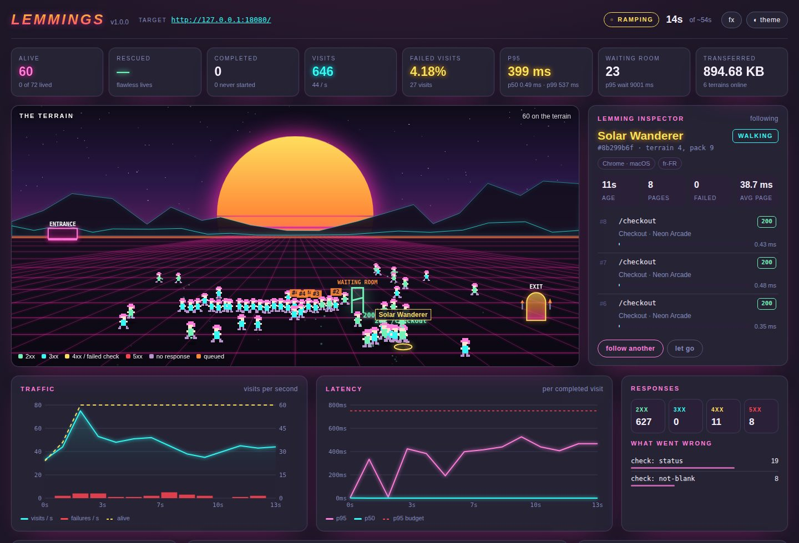
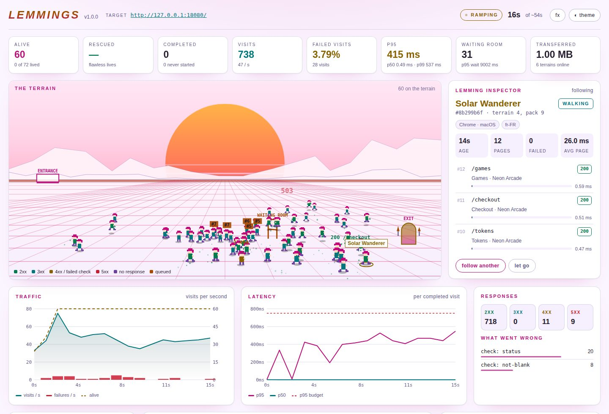
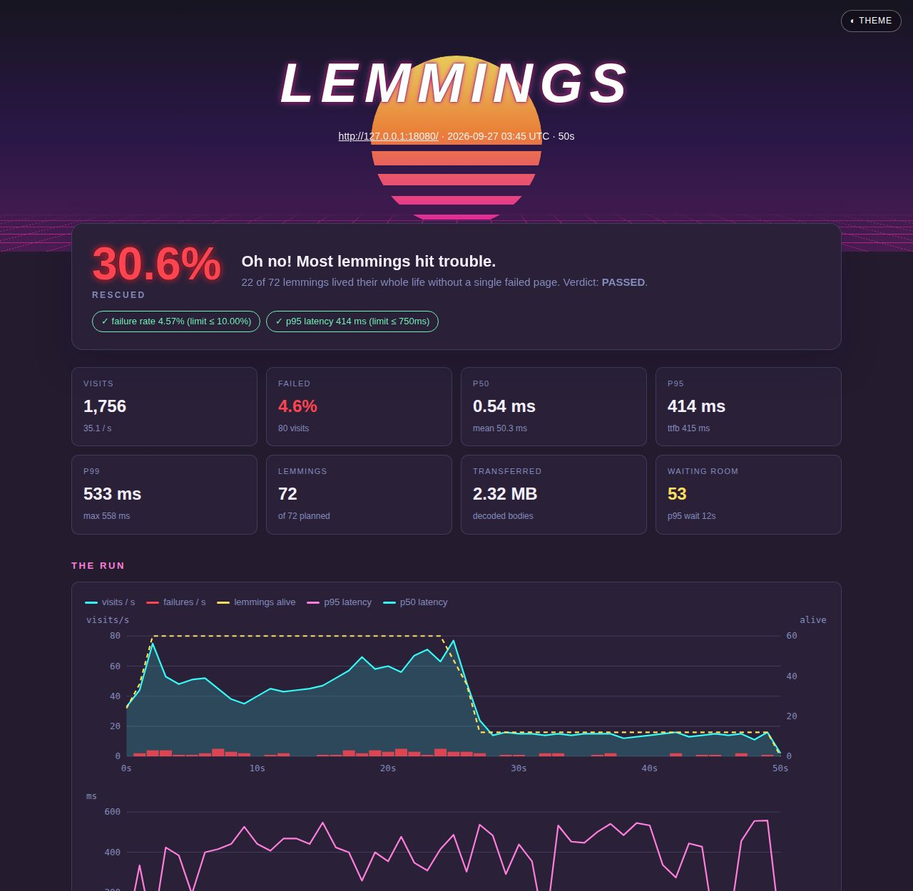

# Lemmings

> Simulating real-world NPC traffic during high-load events. Inspired by a beloved childhood [videogame](https://en.wikipedia.org/wiki/Lemmings_(video_game)).

[](https://pkg.go.dev/github.com/andreimerlescu/lemmings)
[](https://goreportcard.com/report/github.com/andreimerlescu/lemmings)
[](LICENSE)



---

Your company is about to spend $50,000 on a TV commercial. Traffic is going to
spike the moment it airs. Does your application actually survive that?

Most teams find out the answer at 8PM on a Tuesday in front of their entire
customer base.

Lemmings lets you find out before that moment, for free, from your own machine —
and lets you watch it happen.

---

## Try It in a Minute

Lemmings ships with **Neon Arcade**, a small local site with healthy pages, a
slow leaderboard, a flaky page, a page that shows an error with a 200, a blank
page, a broken link and a waiting room at checkout.

    git clone https://github.com/andreimerlescu/lemmings && cd lemmings
    make demo          # terminal 1: Neon Arcade on 127.0.0.1:8080
    make run           # terminal 2: 72 lemmings for 45 seconds

`make run` prints a `dashboard:` link. Click it — the token rides in the link,
so there is nothing to paste — and watch the lemmings drop from the entrance,
wander the arcade, pile up at the waiting room and head for the exit. Click
any lemming to follow its life.

---

## What Lemmings Is

Lemmings is a **stateful, session-aware, navigating load simulator** written in
Go, shipped as a single self-contained binary.

It is not a request blaster. Tools like wrk, vegeta, and k6 fire requests at a
rate. Lemmings simulates people. Each lemming is a virtual browser session with
its own cookie jar, its own connection pool, its own browser and language, and
its own lifespan. It lands on your site, reads the page, follows a link it
found there, pauses like a person reading, and keeps going until its time runs
out — checking every page it reads for the failures a person would notice.

The result is a load test that reveals what actually happens to your
application when real people use it: not only how fast it answers, but how
many of your visitors got through their whole visit without anything going
wrong.

---

## The Geographic Metaphor

Lemmings organises concurrency using a three-tier geographic model that maps
directly to how engineers think about real-world traffic events.

**Terrain** is the top-level group. Think of it as a region or state. You
control how many terrains are active with -terrain.

**Pack** is the number of lemmings per terrain. Think of it as the population
density of each region. You control pack size with -pack.

**Limit** is the ceiling on lemmings alive at once — the system protection
valve that prevents terrain × pack sessions from all starting simultaneously
on a machine that cannot support them. Lemmings waiting for a slot cost
nothing. You control it with -limit.

A systems engineer planning for a product launch can say: "I expect traffic
from 50 regions, with 100 concurrent users per region, each staying for 30
seconds." That translates directly to:

    lemmings -hit https://myapp.com -terrain 50 -pack 100 -until 30s -ramp 5m

The total load — 5,000 lemmings, each reading pages for 30 seconds — is
predictable, auditable, and reproducible.

---

## What a Lemming Does

Each lemming is born with a name (Neon Rider, Chrome Moth, Velvet Glider…), a
browser identity — desktop or mobile — and a language, and keeps them for its
whole life. During its life it:

1. Lands on `-hit` and reads the page
2. Picks one of the links on that page and follows it, sending the page it came
   from as the Referer — or, with `-navigation random`, picks any indexed page
3. Records the status, every redirect, time to first byte, connection setup,
   total latency and bytes
4. Checks the page: the status must be 2xx, an HTML page must not be blank, and
   any `-journey` checks for that step must pass
5. Compares the body's SHA-512 with the one indexed at boot
6. If it encounters a waiting room, waits in line — reporting its position as
   it changes — until it is admitted or its time runs out
7. Pauses for a random think time between `-think-min` and `-think-max`,
   longer if the server asked for it with `Retry-After`
8. Repeats until `-until` expires, it has read `-max-pages`, or its journey is
   done
9. Walks home, and reports its whole life to the swarm

Every lemming has its own cookie jar and its own keep-alive connections.
Session cookies never leak between lemmings, and each pays for its own TLS
handshake, exactly as separate visitors do.

Lemmings never follow log-out, delete or download links, or links that leave
your origin, so a load test cannot sign its own sessions out or mutate data by
wandering.

---

## The Dashboard

While lemmings runs, a live dashboard is available at http://localhost:4000.
The terminal prints a link with a one-time token in its fragment; opening it
signs you in and removes the token from the address bar. The token is a
random 256-bit value and only its SHA-512 hash is kept in memory.

**The terrain** is the heart of it. Lemmings drop from the entrance hatch onto
a synthwave grid and walk it. Every page they read shows on them:

| What you see | What happened |
|---|---|
| a hop and a green sparkle | a 2xx page that passed every check |
| a cyan bounce | a redirect |
| a yellow `?` and a stumble | a 4xx, or a page that failed a check |
| a red burst and a dazed lemming | a 5xx |
| a glitch | no response at all |
| a line forming at the waiting room, positions overhead | your waiting room is holding people |
| a lemming walking into the exit | its life is over — green sparkles if it never saw a failure |

Up to 160 lemmings are on the terrain at once, however large the swarm; the
rest are in the numbers around it.

**Follow a lemming.** Click one (or press `f`) and the inspector follows its
life: name, browser, language, terrain and pack, and every page it read with
status, latency and time to first byte, queue time, redirects and why a page
failed. When it dies you get its epitaph.

Around the terrain: live totals, traffic and latency charts with hover
read-outs, response codes and what went wrong, a terrain map that lights up as
the ramp brings terrains online, the busiest paths, and a feed of happenings.
When the run ends, a "level complete" card shows how many lemmings you
rescued.



The dashboard follows your system's light or dark preference in the
Synthwave '84 palette; `t` switches theme, `x` turns motion effects off (they
are off by default when your system asks for reduced motion), `esc` stops
following. It works offline, loads nothing from the internet, and is served
with a strict Content-Security-Policy to localhost only.

---

## Journeys

A journey is a finite, ordered list of pages with checks, for the paths that
matter most. Every lemming walks it once:

```json
{
  "name": "buy-tokens",
  "steps": [
    { "name": "arrive", "path": "/", "expect": { "status": [200], "title_contains": "Neon Arcade", "selectors": ["nav", ".grid"] } },
    { "name": "pick a game", "path": "/games/outrun", "expect": { "contains": ["High score"] } },
    { "name": "checkout", "path": "/checkout", "expect": { "contains": ["Tokens are on the way"] } },
    { "name": "tokens", "path": "/tokens", "expect": { "not_contains": ["Something went wrong"] } }
  ]
}
```

    lemmings -hit http://127.0.0.1:8080/ -journey examples/journeys/buy-tokens.json

| Check | Passes when |
|---|---|
| `status` | the final status is one of these (default: any 2xx) |
| `content_type` | the media type matches, e.g. `text/html` |
| `contains` / `not_contains` | the body does / does not contain each string |
| `title_contains` | the page `<title>` contains the string |
| `selectors` | an element matching each `tag`, `#id` or `.class` exists |

Journeys are GET-only — lemmings never submit forms — and every path must stay
on the `-hit` origin. Unknown fields are rejected, so a typo cannot silently
disable a check. Cookies set along the way persist for the lemming's life.

---

## URL Discovery

Before a single lemming moves, lemmings indexes your application's URL surface
using a three-strategy waterfall:

**Strategy 1 — sitemap.xml.** If your application serves a sitemap at the
standard path, lemmings fetches it, parses all loc entries (including nested
sitemap index files, safely bounded against cycles), fetches each URL to
compute its baseline checksum, and builds the shared URL pool. This is the
preferred strategy.

**Strategy 2 — robots.txt.** If no sitemap is found at the standard path,
lemmings checks robots.txt for a Sitemap: directive and follows it, as long as
it is on the same origin.

**Strategy 3 — crawl.** If neither sitemap strategy yields results and
-crawl is enabled, lemmings performs a depth-bounded crawl from the origin,
following anchor links and building the URL pool from what it discovers.
The crawl runs for a maximum of 5 minutes.

**Fallback.** If no strategy produces results, lemmings uses the origin URL
alone. The test still runs — and with link navigation, lemmings still find
their way around from there.

Origins are compared by scheme, host and port — `example.com.evil.test` is not
`example.com` — and nothing off your origin is ever requested.

Every URL in the pool has a SHA-512 checksum computed at index time. A visit
whose body differs records `Match: false`. Dynamic pages change on every
request, so checksum changes are reported as information; pass
`-strict-checksum` to fail visits on them.

---

## Waiting Room Integration

Lemmings is built with first-class support for the
[room](https://github.com/andreimerlescu/room) package.

When a lemming receives a response containing the room package's waiting room
page, it detects this automatically — no configuration required. It reads its
queue position, polls the same URL on the room package's 3-second interval,
and reports every change of position (you will see the number over its head on
the dashboard) until it is admitted or its `-until` deadline expires.

The report tells you:

- How many visits were held in the waiting room, and the deepest position
- How long they waited: mean, p95 and longest
- How many lemmings died in the line without ever reaching your application

Queue time is reported on its own and kept out of latency percentiles, which
measure how long your server took to serve the page a lemming finally got.
Tune room capacity, run lemmings again, and repeat until the wait is
acceptable.

---

## The Ramp

Real traffic does not arrive all at once. A TV commercial airs, interest builds,
and traffic climbs over minutes before sustaining at peak. Lemmings models this
with -ramp.

When -ramp is set, lemmings brings terrain groups online linearly over the ramp
duration rather than spawning everything simultaneously. A 5-minute ramp with
50 terrain groups means one new terrain group comes online every 6 seconds,
each bringing its full pack of lemmings with it. The terrain map on the
dashboard lights up as they arrive.

This lets you observe how your application behaves during the climb to peak load
— which is often where failures first appear — not just at the peak itself.

---

## Reports

When the swarm completes — or when you press Ctrl-C — lemmings writes three
reports and delivers them to every destination in `-save-to`:

- **HTML** — a self-contained Synthwave '84 report, light and dark, with no
  scripts and nothing loaded from the internet
- **Markdown** — the same findings as text, for pull requests and email
- **JSON** — everything, for dashboards, diffs and your own tooling



It leads with the number that matters to a person: **how many lemmings you
rescued** — the share whose whole life had no failed page. Then the traffic
and latency over time, response codes, what went wrong and how often, the
waiting room, per-path p50/p95/p99, and a few lemmings worth meeting:

| | |
|---|---|
| **The Explorer** | visited the most pages |
| **Patient Zero** | hit the first failure of the run |
| **The Unlucky One** | got the slowest page of the run |
| **The Patient One** | spent longest in the waiting room |

Each is shown page by page, so you can read exactly what one visitor went
through.

Reports never contain credentials, email addresses, bucket names, URL
userinfo or query strings.

### CI Gates and Exit Codes

    lemmings -hit https://staging.myapp.com -terrain 5 -pack 10 -until 60s -ramp 10s \
        -tty=false -max-failure-rate 0.01 -p95-budget 800ms

| Exit | Meaning |
|---|---|
| `0` | the run finished and every gate passed |
| `1` | configuration, indexing or report delivery failed |
| `2` | the run finished but `-max-failure-rate` or `-p95-budget` was exceeded |
| `130` | interrupted with Ctrl-C or SIGTERM — the partial report was still delivered |

The failure rate counts visits that failed transport, status or a check.
Visits cut short because a lemming's life ended are "cancelled" and excluded,
as they say nothing about your server.

`-trace-file visits.jsonl` additionally streams every visit as a JSON line. It
never overwrites an existing file, and the report states how many lines were
written.

---

## Prometheus Metrics

When -observe is set, lemmings starts a Prometheus metrics endpoint on
http://localhost:9090/metrics (configurable via -metrics-port). The endpoint
is scraped by any standard Prometheus installation with no additional
configuration.

Thirteen metrics are exposed under the lemmings_ namespace:

| Metric | Type | Description |
|---|---|---|
| lemmings_alive | Gauge | Lemmings currently running |
| lemmings_completed_total | Counter | Lemmings that completed their life |
| lemmings_failed_total | Counter | Lemmings that failed to start |
| lemmings_visits_total | Counter | Page visits by status class (2xx/3xx/4xx/5xx) |
| lemmings_failed_visits_total | Counter | Visits that failed transport, status or a check |
| lemmings_cancelled_visits_total | Counter | Visits cut short when a lemming's life ended |
| lemmings_visit_duration_seconds | Histogram | Visit latency distribution |
| lemmings_bytes_total | Counter | Total decoded bytes transferred |
| lemmings_waiting_room_total | Counter | Waiting room stays |
| lemmings_waiting_room_duration_seconds | Histogram | Time spent in waiting rooms |
| lemmings_terrains_online | Gauge | Terrain groups currently active |
| lemmings_dropped_logs_total | Counter | Life records dropped due to collector pressure |
| lemmings_overflow_logs_total | Counter | Life records routed to the overflow channel |

The visit duration histogram's URL label granularity is controlled by
-metrics-url-label with three values:

- **full** — full URL as label. Capped at 999 distinct values.
- **path** — path component only, query strings stripped. Default.
- **none** — no URL label. Zero cardinality risk. Best for large sitemaps.

The 999-value cardinality cap exists because a histogram with 1000+ URL labels
at 15 buckets each creates 15,000+ active time series from one label alone,
which exceeds the comfortable range of a default Prometheus installation. URLs
beyond the cap are recorded under the synthetic label value "other".

    lemmings -hit https://myapp.com -terrain 50 -pack 50 -until 30s \
        -observe -metrics-port 9090 -metrics-url-label path

---

## Report Delivery

The -save-to flag accepts a comma-separated list of destinations. Each
destination is parsed by its URI prefix and routed to the appropriate delivery
target. Multiple targets run concurrently — a failure in one does not prevent
others from receiving the report. Delivery runs even after Ctrl-C.

    lemmings -hit https://myapp.com \
        -save-to ".,s3://my-bucket/lemmings,mailto:ops@mycompany.com?subject=Lemmings%20Results"

Lemmings also reads the LEMMINGS_SAVE_TO environment variable as an additive
source of destinations. Entries in the environment variable are appended to
those passed via -save-to (comma-separated), duplicates are removed, and the
combined list becomes the final target set. This makes it easy to inject a
permanent archive destination (such as a shared S3 bucket) from a deployment
environment without forcing every invocation to specify it:

    export LEMMINGS_SAVE_TO="s3://company-load-tests/archive"
    lemmings -hit https://myapp.com -save-to "."

The run above delivers the report to both `.` (from the flag) and
`s3://company-load-tests/archive` (from the env var).

### Local Delivery

The default target. Writes all three files to:

    <save-to>/lemmings/<domain>/lemmings.YYYY.MM.DD.<domain>.md
    <save-to>/lemmings/<domain>/lemmings.YYYY.MM.DD.<domain>.html
    <save-to>/lemmings/<domain>/lemmings.YYYY.MM.DD.<domain>.json

The directory tree is created automatically. Existing files with the same name
are overwritten — filenames include the date so this only occurs if lemmings
runs more than once on the same day against the same target. Use a separate
-save-to directory per run to keep every report.

    -save-to .
    -save-to /var/reports
    -save-to file:///var/reports

### S3 Delivery

Uploads all three files to an S3 bucket with correct Content-Type headers so
they render correctly when accessed via S3 URLs or CloudFront.

    -save-to s3://my-bucket/lemmings/reports

Credentials are read from the standard AWS credential chain in order:

1. Environment variables: AWS_ACCESS_KEY_ID, AWS_SECRET_ACCESS_KEY, AWS_SESSION_TOKEN
2. Shared credentials file: ~/.aws/credentials
3. IAM instance role — works automatically on EC2, ECS, and Lambda

The bucket region is read from AWS_REGION, AWS_DEFAULT_REGION or your AWS
config file; lemmings says so plainly if none is set. The bucket must already
exist and the credentials must have s3:PutObject permission. Lemmings does not
create the bucket.

### Email Delivery

Sends the HTML report inline in the email body and the markdown report as an
attachment. Uses standard RFC 6068 mailto URI syntax.

    -save-to "mailto:ops@mycompany.com?subject=Lemmings%20Results&cc=team@mycompany.com"

SMTP configuration is read from environment variables:

| Variable | Default | Description |
|---|---|---|
| LEMMINGS_SMTP_HOST | localhost | SMTP server hostname |
| LEMMINGS_SMTP_PORT | 587 | SMTP server port |
| LEMMINGS_SMTP_USER | | SMTP username (optional) |
| LEMMINGS_SMTP_PASS | | SMTP password (optional) |
| LEMMINGS_SMTP_FROM | lemmings@localhost | From address |

SMTP flags override environment variables when both are present:

    lemmings -hit https://myapp.com \
        -save-to "mailto:ops@mycompany.com" \
        -smtp-host mail.mycompany.com \
        -smtp-port 587 \
        -smtp-user sender@mycompany.com \
        -smtp-from noreply@mycompany.com

Port 465 uses implicit TLS. Every other port upgrades with STARTTLS whenever
the server offers it; if the server offers STARTTLS and the handshake fails,
delivery fails — the report is never resent in plaintext. Credentials are only
ever sent over TLS or to localhost.

---

## Quick Start

    go install github.com/andreimerlescu/lemmings@latest

Run a basic test against a local server:

    lemmings -hit http://localhost:8080/ -terrain 10 -pack 10 -until 30s

Run with a ramp-up period:

    lemmings -hit https://myapp.com -terrain 50 -pack 50 -until 30s -ramp 5m

Walk a journey and fail CI when too many visits fail:

    lemmings -hit https://staging.myapp.com -terrain 5 -pack 10 -until 60s \
        -journey checkout.json -max-failure-rate 0.01 -tty=false

Saturate the target with no pauses, the pre-1.0 behaviour:

    lemmings -hit https://myapp.com -terrain 10 -pack 50 -until 30s \
        -think-min 0 -think-max 0 -navigation random

Run with crawl enabled for sites without a sitemap:

    lemmings -hit https://myapp.com -terrain 10 -pack 10 -until 30s -crawl

Run with Prometheus metrics and delivery everywhere:

    lemmings -hit https://myapp.com \
        -terrain 50 -pack 50 -until 30s \
        -observe \
        -save-to ".,s3://my-bucket/lemmings,mailto:ops@mycompany.com?subject=Launch%20Test"

---

## All Flags

### Core

| Flag | Alias | Default | Description |
|---|---|---|---|
| -hit | -h | http://localhost:8080/ | Origin URL to load test |
| -terrain | -t | 50 | Number of terrain groups |
| -pack | -p | 50 | Number of lemmings per terrain |
| -limit | -l | 100 | Lemmings alive at once. -1 disables the ceiling (dangerous) |
| -until | -u | 30s | How long each lemming lives |
| -ramp | -r | 5m | Duration to bring all terrains online |
| -crawl | -c | false | Crawl origin for links when no sitemap is found |
| -crawl-depth | -cd | 3 | How many links deep to crawl |
| -tty | | true | Use carriage return for live output. Set false for CI |
| -color | | true | Colour terminal output. Also off with NO_COLOR or -tty=false |
| -version | -v | | Print the version |

### Behaviour

| Flag | Alias | Default | Description |
|---|---|---|---|
| -navigation | -nav | links | `links`: follow links on the page just read. `random`: pick from the pool |
| -think-min | -tmin | 300ms | Minimum pause between pages |
| -think-max | -tmax | 1.2s | Maximum pause between pages |
| -journey | -j | | JSON file with an ordered journey and checks |
| -max-pages | -mpg | 0 | Pages per lemming before it leaves. 0 browses until -until |
| -request-timeout | -rt | 10s | Timeout for one request, including redirects and body |
| -max-body-bytes | -mbb | 2097152 | Largest decoded body read per page; larger fails the visit |
| -strict-checksum | -sc | false | Fail visits whose body changed since indexing |

### Gates and Evidence

| Flag | Alias | Default | Description |
|---|---|---|---|
| -max-failure-rate | -mfr | -1 | Exit 2 when more than this share (0..1) of visits fail. Negative disables |
| -p95-budget | -p95 | 0 | Exit 2 when p95 latency exceeds this. 0 disables |
| -trace-file | -tf | | Write every visit to this new JSONL file |

### Report Delivery

| Flag | Alias | Default | Description |
|---|---|---|---|
| -save-to | -s | . | Comma-separated delivery destinations: local path, s3://, or mailto:. Combined additively with the LEMMINGS_SAVE_TO environment variable. Examples: `.`, `/var/reports`, `s3://my-bucket/lemmings`, `mailto:ops@example.com?subject=Load%20Test`, or a comma-separated combination of all three. |

### SMTP (for mailto: delivery)

| Flag | Alias | Default | Description |
|---|---|---|---|
| -smtp-host | -sh | | SMTP hostname. Overrides LEMMINGS_SMTP_HOST |
| -smtp-port | -sp | 0 | SMTP port. Overrides LEMMINGS_SMTP_PORT |
| -smtp-user | -su | | SMTP username. Overrides LEMMINGS_SMTP_USER |
| -smtp-pass | -spw | | SMTP password. Overrides LEMMINGS_SMTP_PASS |
| -smtp-from | -sf | | From address. Overrides LEMMINGS_SMTP_FROM |

### Dashboard

| Flag | Alias | Default | Description |
|---|---|---|---|
| -dashboard-port | -dp | 4000 | Port for the live dashboard |

### Prometheus

| Flag | Alias | Default | Description |
|---|---|---|---|
| -observe | -obs | false | Enable Prometheus metrics exporter |
| -metrics-port | -mp | 9090 | Port for the /metrics endpoint |
| -metrics-url-label | -mul | path | URL label granularity: full, path, or none |

---

## Understanding the Output

The boot summary printed before any lemming moves tells you exactly what is
about to happen:

      ░▒▓ L E M M I N G S ▓▒░   v1.0.0
      simulated visitors · real consequences
    ─────────────────────────────────────────
      target:         http://127.0.0.1:8080/

      terrain:        6 groups
      pack:           12 lemmings per terrain
      total:          72 lemmings

      until:          20s per lemming
      ramp:           5s to full concurrency
      est. duration:  ~25s wall clock

      limit:          72 lemmings at once
      navigation:     links
      think:          300ms – 1.2s between pages
      save-to:
        → ./reports
      gates:          failure rate ≤ 10.00%, p95 ≤ 750ms

      dashboard:      http://localhost:4000/#token=a3ac3f0d…
      token:          a3ac3f0d…

The live ticker updates every second, with a sparkline of visits per second:

    [12s] ▄▅▆▆█▇▇▆▅▅▆▆ 52/s | terrains: 6 | alive: 72 | done: 0 | visits: 628 | 2xx: 621 4xx: 5 5xx: 2 | p95: 407 ms | failed: 18 | room held: 12

The final summary closes the run, followed by where the reports went and the
verdict:

    ─────────────────────────────────────────
      lemmings v1.0.0 — final summary
    ─────────────────────────────────────────
      target:         http://127.0.0.1:8080/
      total lemmings: 72
      completed:      72
      failed:         0

      total visits:   1,220  ▅▅▇▇█▇█▆▆▆▆▆▆▅▆▇▇▇▇▇▇▆▅▂▂
      total bytes:    1.65 MB
      failed visits:  42 (3.50%)
      cancelled:      21 (life ended mid-visit)

      2xx:            1,192
      3xx:            0
      4xx:            12
      5xx:            12

      latency:        p50 0.54 ms · p95 397 ms · p99 520 ms
      waiting room:   63 lemmings held
    ─────────────────────────────────────────
      report (md):    reports/lemmings/127.0.0.1-8080/lemmings.2026.09.27.127.0.0.1-8080.md
      report (html):  reports/lemmings/127.0.0.1-8080/lemmings.2026.09.27.127.0.0.1-8080.html
      report (json):  reports/lemmings/127.0.0.1-8080/lemmings.2026.09.27.127.0.0.1-8080.json

      Oh no! Many lemmings hit trouble.
      you rescued 55.6% — 40 of 72 lemmings lived without a failed page.
      ✓ failure rate 3.50% (limit ≤ 10.00%)
      ✓ p95 latency 397 ms (limit ≤ 750ms)
      ✓ PASSED

That run is worth reading closely. The failure rate is a healthy 3.5% and
both gates pass — yet almost half the lemmings met at least one failure
during a 20-second visit. Per-request numbers look fine while the visit
doesn't: that is the gap lemmings is built to show you.

---

## When to Use Lemmings

**Before a major traffic event.** A product launch, a sale, a TV spot, a viral
social post. Run lemmings with parameters that match your expected traffic shape.
If it passes your gates and rescues the lemmings you need it to, you are ready.
If it does not, you have time to fix it.

**For waiting room capacity planning.** If you use the room package, lemmings
tells you exactly how many users will see the waiting room at a given traffic
volume, how long they will wait, and how many will give up. Tune room parameters
and re-run until the numbers are acceptable.

**For infrastructure sizing.** Increase -terrain and -pack until the first 5xx
responses appear. That is your capacity ceiling. Add infrastructure and re-run
to verify the ceiling moved.

**As a daily CI health check.** Run lemmings with a small -terrain and -pack
and a -journey against staging on every deploy, with -max-failure-rate and
-p95-budget as gates. A change in failure rate, rescued share or p95 is an
early signal of regression before customers see it.

**For post-incident analysis.** Reconstruct the traffic parameters from your
incident logs and re-run. The per-path breakdown and the notable lemmings show
which routes degraded first and what one visitor went through.

---

## What Lemmings Does Not Measure

Lemmings reads what your server sends. It does not run JavaScript, load images,
stylesheets or scripts, or judge how a page looks — assert on the text and
elements your server sends. It reports the latency it observed: each lemming
waits for a page before choosing the next, so a slow server receives fewer
requests, as it would from real people. And it runs from one machine, so it
does not model network distance. Within that scope, every number is exact or
states its method.

---

## How Results Can Be Trusted

Lemmings ships with a test suite of 438 tests — unit, integration,
end-to-end, fuzz and benchmark — that pass under the race detector on Linux,
macOS, and Windows. See [TESTS.md](TESTS.md) for the full breakdown.

The short version:

- Every visit is counted the moment it completes, with atomic counters verified
  under the race detector. The 2xx count in your report is exact.

- Lifecycle events (lemming born, died, failed) are emitted by exactly one
  component — the Terrain — and a test runs a real swarm and counts exactly
  one birth and one death per lemming, so `alive` and `completed` are exact
  everywhere they appear.

- Percentiles are exact nearest-rank values while every sample is kept, and
  within a tested 2% bound beyond that; the report says which. Waiting-room
  time is never counted as latency.

- Nothing is lost silently. If the collector falls behind, the dropped count
  appears in the ticker, the dashboard and the report — and visit totals stay
  exact regardless.

- Waiting room detection, position tracking and admission are verified against
  real room package HTML, including admission to a page that changed.

- End-to-end tests build the real binary and check exit codes, all three
  report formats, the dashboard's sign-in and live data, and Ctrl-C.

- Report delivery targets are tested independently, and a test proves no
  credential, address or query string reaches any report.

- Parsing functions that consume externally-sourced bytes — sitemap XML, HTML
  anchor tags, URL resolution, waiting room detection, SHA-512 hashing,
  dashboard authentication tokens — are covered by fuzz targets that prove
  they never panic, never leak malformed state, and always satisfy their
  documented invariants regardless of what the upstream sends.

---

## Dependencies

| Package | Purpose |
|---|---|
| [figtree](https://github.com/andreimerlescu/figtree) | CLI configuration management with validators and aliases |
| [sema](https://github.com/andreimerlescu/sema) | Semaphore primitive for the concurrency ceiling |
| [room](https://github.com/andreimerlescu/room) | Waiting room integration (optional — detected automatically) |
| golang.org/x/net/html | HTML parsing for links, titles and checks |
| golang.org/x/net/publicsuffix | Cookie jar domain scoping |
| golang.org/x/term | Terminal width and colour detection |
| github.com/aws/aws-sdk-go-v2 | S3 report upload |
| github.com/prometheus/client_golang | Prometheus metrics exporter |
| github.com/prometheus/client_model | Prometheus DTO types used by observer_test.go for metric assertions |

The dashboard and reports are embedded in the binary. There are no runtime
dependencies to install.

---

## Contributing

Lemmings is open source under the Apache 2.0 license. Contributions are welcome.

Before opening a pull request:

- Run `make build-check` and `go test -race -count=1 ./...` and confirm every
  test passes. The `-count=1` flag disables test result caching; without it
  your IDE or local Go toolchain may run a stale compiled test binary and mask
  real failures. `make test-short` skips the end-to-end tests while iterating.
- Add tests for any new functions following the patterns in the existing test files
- Read TESTS.md to understand what the test suite is trying to prove and why
- Preserve the lifecycle event ownership contract: `EventLemmingBorn`,
  `EventLemmingDied`, and `EventLemmingFailed` are emitted exclusively by the
  `Terrain`. `Lemming.Run` emits only per-visit and waiting room events.
  Breaking this contract corrupts every counter-based subscriber in the package.
- The dashboard lives in `web/` and the report templates in `templates/`.
  Both are embedded. Keep them free of inline styles, `innerHTML` and anything
  loaded from the internet; `TestDashboard_CSPAllowsExactlyTheInlineAssets`
  will tell you if you slip.

The test suite is not optional. Every function in the package has a corresponding
test that verifies its contract. New functions without tests will not be merged.

See [CHANGELOG.md](CHANGELOG.md) for what changed in each release.

---

## License

Apache 2.0. See [LICENSE](LICENSE).

---

Built with care for the engineers who find out their application crashes
the hard way — and for the ones who use lemmings so they never have to.
